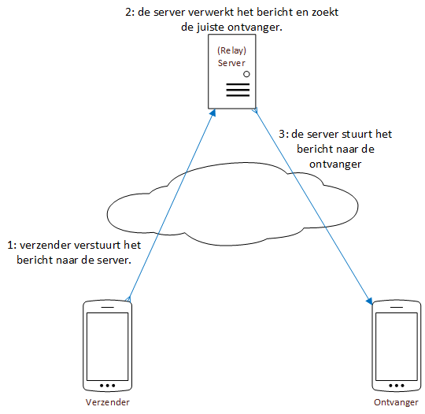
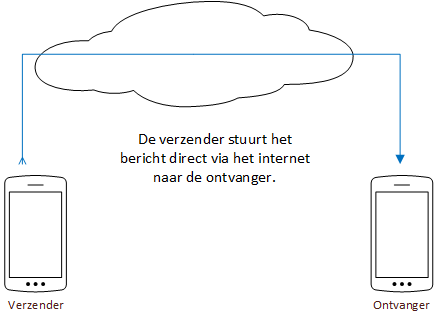

# Hoe komen berichten van de verzender naar de ontvanger

Er zijn twee veelgebruikte manieren om berichten te besturen, gecentraliseerd en gedecentraliseerd.

## Gecentraliseerd

Apps zoals Whatsapp, Instagram, Snapchat en nog veel meer verzenden de berichten gecentraliseerd.
Dat betekent dat de berichten die jij via je telefoon of computer verstuurt worden verzonden naar een speciale computer, genaamd een "server". 
Deze computer kan je vergelijken met een tussenpersoon: hij is speciaal ingericht om de berichten te verwerken en naar de juiste ontvanger te sturen.

De server houdt zelf een lijst bij van alle personen die de chat applicatie gebruiken, zo weet hij wie de ontvanger is die jij bedoelt.
Bij veel applicaties moet je registreren om in deze lijst te komen, denk hierbij aan een gebruikersnaam of telefoonnummer.

De nadelen hiervan zijn dat de server en de mensen die hem beheren al jouw berichten kan lezen, veranderen en bewaren.
Als de server jouw berichten bewaart en je criminaliteit pleegt dan zou de overheid data over jou op kunnen vragen en kunnen gebruiken voor een rechtzaak.
Ook kan de server technische problemen ervaren of uit de lucht gehaald worden, en dan komen de berichten niet meer over.

## Gedecentraliseerd

Apps zoals Tox en e-Chat versturen de berichten direct naar de ontvanger, zonder server in het midden.

Omdat er geen server als tussenpersoon is, kan de service nooit uit de lucht gehaald worden door een kwaadwillig persoon.
Ook worden de berichten niet bewaard behalve op jouw telefoon en de ontvanger.

Een groot nadeel hiervan is dat er geen centrale server is om te controleren of de ontvanger echt wel degene is aan wie je het bericht stuurt.
Het kan namelijk zijn dat iemand identiteitsfraude pleegt en dat hij/zij dus dezelfde naam gebruikt.
